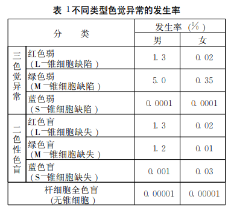

# myColor

[酵︹谋蒓︹.pdf](file:///D:/download/酵︹谋蒓︹.pdf)

## 成因

大部分色盲患者的锥细胞组成与正常人不同‚ 要么是缺少一种锥细胞‚要么是锥细胞的吸收峰值不 正常。

视网膜上有两种细胞。亮度细胞和色觉细胞，他们将光线信息传递给我们的大脑。

> 有1.2亿个亮度细胞(视杆细胞)在视网膜上均匀分布，对光非常敏感。
> 色觉细胞([视锥细胞](https://www.zhihu.com/search?q=视锥细胞&search_source=Entity&hybrid_search_source=Entity&hybrid_search_extra={"sourceType"%3A"answer"%2C"sourceId"%3A615469094}))是负责我们色觉的细胞。只有约600万个。

色觉细胞分为三种，每种对彩色光源的反应不同。每种色觉细胞均存在特定的颜色吸收曲线，其在色谱中的不同点具有峰值。

> S锥：对短波长光敏感，峰值420nm
> M锥：对中波长光敏感，峰值530nm
> L锥：对长波长光敏感，峰值560nm

图中横坐标为颜色，纵坐标为色觉细胞所感受到的亮度。

三根实线，从左到右分别代表蓝色色觉细胞，绿色色觉细胞，红色色觉细胞对不同颜色的亮度感受。(虚线为亮度细胞。但大脑不会使用它来判断颜色。)

图中横坐标为颜色，纵坐标为色觉细胞所感受到的亮度。

三根实线，从左到右分别代表蓝色色觉细胞，绿色色觉细胞，红色色觉细胞对不同颜色的亮度感受。(虚线为亮度细胞。但大脑不会使用它来判断颜色。)

图中横坐标为颜色，纵坐标为色觉细胞所感受到的亮度。

三根实线，从左到右分别代表蓝色色觉细胞，绿色色觉细胞，红色色觉细胞对不同颜色的亮度感受。(虚线为亮度细胞。但大脑不会使用它来判断颜色。)

**当一种色觉细胞较少时，就是色弱。**

## 类型

### 三色觉异常

三色觉异常是由一种或多种视锥 细胞发生转变所造成的。

红色 觉异常者的 Ｌ－锥细胞变得更像 Ｍ－锥细胞‚绿色觉 异常者的 Ｍ－锥细胞变得更像 Ｌ锥细胞。

#### 红色觉异常

对红色觉异常这类色觉缺陷的 更恰当描述应为 “红色弱 ”。对于正常人所观察到的 任何红色‚红色觉异常者无论是对色彩的饱和度还是 亮度的感觉能力都比较弱。红色、橘红、黄色、黄绿和 绿色‚看上去都会有些偏向绿色‚而且比正常人所看到 的要浅。正常人在紫色中所看到的红色成分对于红色 觉异常者来说‚微弱得无法观察到‚所以只能看到蓝色 成分。因此‚正常人看到的 “紫色 ”对他们来说只能是 一种深蓝色。

#### 绿色觉异常

绿色觉异常即 “绿色弱 ”。和红 色觉异常者类似‚绿色觉异常者区分红色、橘红、黄色、 绿色的能力有缺陷。他们无法正确识别这些颜色‚是 因为对他们来说这些颜色都成了红色。

### 二色性色盲

二色性色 盲完全缺乏三种视锥细胞中的一种。

#### 红色盲

对于红色盲者来说‚红色、橘红色和 黄色的亮度比常态大大下降。这种亮度减弱是非常明 显的‚使得这类红色与黑色或暗灰色相混淆‚红色的交 通灯在他们看来可能会觉得没有亮。他们可以学会根 据其明显的亮度基础把红色和黄色与绿色区分开来‚ 而不是显而易见的色彩区别。

#### 绿色盲

绿色盲者和红色盲者一样被色彩区 分问题所困扰‚但是没有亮度异常变暗。对于他们来 说‚红、橙、黄、绿这些色彩名称除了是不同的符号之 外‚再没有别的意义了。

### 全色盲与蓝色锥细胞全色盲

全色盲是一种完 全丧失各种色觉的色觉异常类型。

蓝色锥细胞全色盲者缺失了 Ｌ－锥细胞和 Ｍ－锥 细胞‚仅剩下了 Ｓ－锥细胞和视杆细胞。因为 Ｓ－锥细 胞无法使我们感受亮度‚所以‚蓝色锥细胞全色盲在强 光条件下所遇到的问题和全色盲是一样的‚虽然他们 在小范围内能够区分一些色彩。

## 发生率

